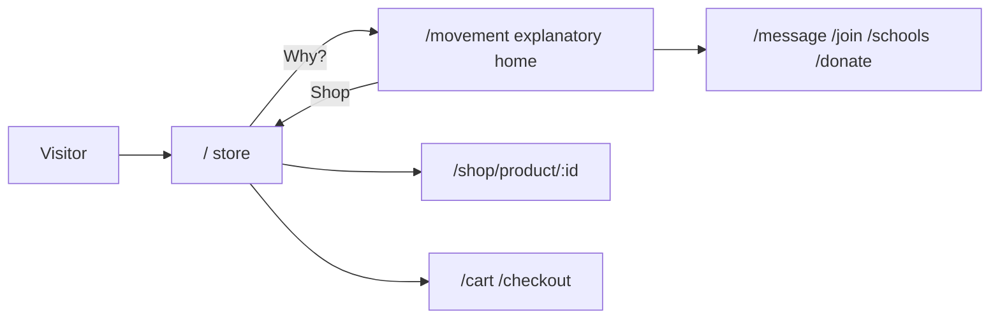

# Two-part site: store front + explanatory

The site becomes two experiences with different chrome. The current homepage, message, join, schools, donate, and quiz stay as they are. They are just no longer the landing page.

## URLs

- **`/` and `/en`** — new store landing (hero, lookbook, product grid).
- **`/shop` and `/en/shop`** — same storefront component (so existing “לחנות” links keep working). With `?category=` it skips the hero/lookbook and shows only the filtered grid.
- **`/shop/product/:id`**, **`/cart`**, **`/checkout`** — stay; they use store chrome.
- **`/movement` and `/en/movement`** — current [HomePage.tsx](frontend/src/pages/HomePage.tsx) moved here, content unchanged.
- **`/shop-m`** — keep redirecting into the store (`/` or `/shop`).

Routing change is in [App.tsx](frontend/src/App.tsx): index becomes the store page; add `path="movement"` for `HomePage`.

## Which chrome

One helper, e.g. `isStorePath()`, treats as **store**: `/`, `/shop`, `/shop/*`, `/cart`, `/checkout`, `/my-account`. Everything else is **explanatory**, including `/movement`.

[AppLayout.tsx](frontend/src/components/AppLayout.tsx) already skips top padding on `/` for a full-bleed hero. Extend that to **`/` and `/movement`**, because both landings stay full-bleed.

## Store header (new)

Replace the mixed nav when on a store path in [Header.tsx](frontend/src/components/Header.tsx).

- Logo → `/`
- Text links: Apparel / Bracelets / Accessories → `/shop?category=146` / `20` / `18` (existing Woo IDs in [shop.ts](frontend/src/lib/shop.ts))
- Cart icon
- Small **Why?** → `/movement`
- No Join, Schools, Donate
- Nav stays visible over the product hero (fashion shop, not cinematic hide)

Mobile menu: same items only (categories, cart, Why?).

## Explanatory header (keep)

Current header stays for non-store pages.

- Logo → `/movement` (not `/`, or people bounce into the shop)
- Nav: Message, Join, Schools (unchanged)
- **Shop → `/`** (the bridge)
- Donate stays
- On `/movement`, keep today’s over-hero behavior (centered logo, nav after scroll)

## Store page (new look, blank-canvas)

New page (e.g. [StorePage.tsx](frontend/src/pages/StorePage.tsx)) used for `/` and `/shop`. No slogan, no mission, no “this funds schools”, no school/office/gift cards.

1. **Hero** — full-bleed product (existing hoodie video/poster in [media.ts](frontend/src/lib/media.ts)). Overlay: product name + price + shop, using a featured item from `fetchPopularProducts` (fallback: static media if catalog fails). Not the current “words can build / destroy” copy.
2. **Lookbook** — 2–3 large editorial photos (hoodie, bracelets, bag from existing media or the same popular products). Click goes to that product.
3. **Quiet grid** — popular / catalog products. Cream/white, lots of space, no boxed catalog feel.

Filtered `/shop?category=` shows only the grid + category name, still store chrome.

Rewrite [ShopPage.tsx](frontend/src/pages/ShopPage.tsx) into this (or delete its NGO blocks and point routes at `StorePage`). Drop: `PageHeader` welcome copy, `SHOP_USE_CASES` icon grid, mission `Band`, wholesale/quote/custom row.

## Product tiles and catalog chrome

Restyle [ProductCard.tsx](frontend/src/components/ProductCard.tsx): photo, name, price; no border card; no “Add to cart” on the tile. Click → product page. This also cleans related products on [ProductPage.tsx](frontend/src/pages/ProductPage.tsx). Product page purchase flow stays.

## Store footer vs explanatory footer

[Footer.tsx](frontend/src/components/Footer.tsx) splits:

- **Store:** minimal (logo, terms, Why?). No join/donate/quiz columns.
- **Explanatory:** keep current footer. Change the shop link to `/`. Add `/movement` only if the logo/home target needs it. Do not rewrite explanatory copy.

## What we will not change

- HomePage sections, quiz, join, schools, donate, about — only the route of the current home.
- WooCommerce catalog, cart, checkout.
- Explanatory body links that already go to `/shop` (they land on the same storefront).
- Brand colors (cream / black / red) used in a fashion way, not a new palette.

## Copy to add

Short keys in [strings.ts](frontend/src/i18n/strings.ts): Why?, Apparel, Bracelets, Accessories. No mission sentences on store pages.
